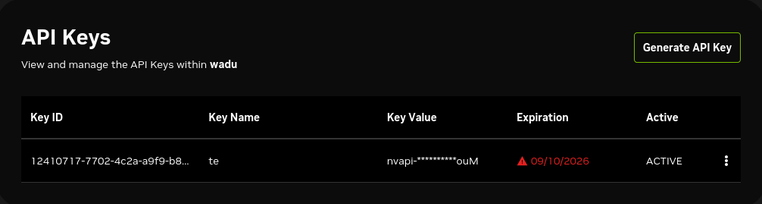
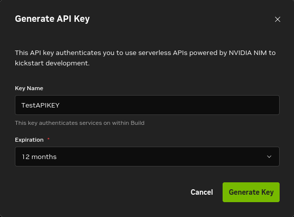
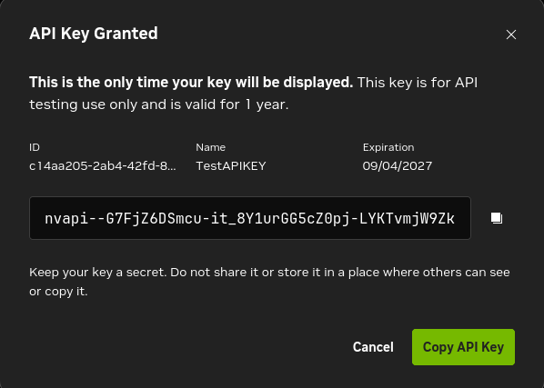
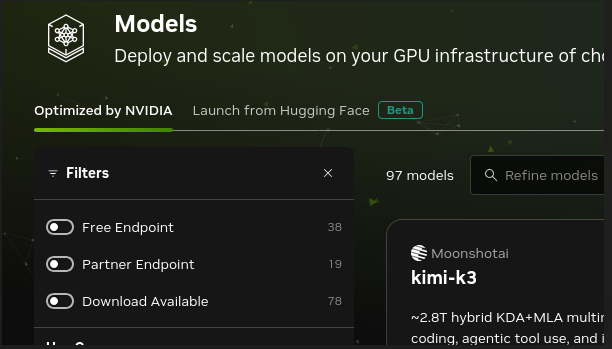
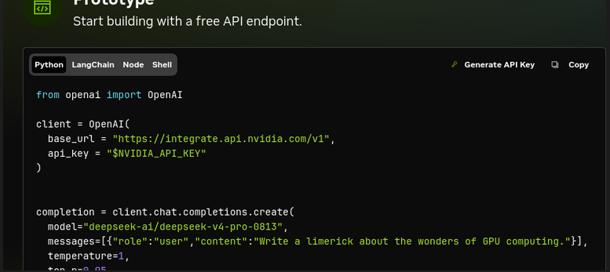
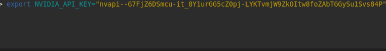

# pdf2notes

Turn any page range of a PDF book into structured, review-ready study notes in Markdown format. The resulting files are immediately ready to drop into **Obsidian** or import into **Notion**.

Works with any **OpenAI-compatible** chat completion API: NVIDIA NIM (`integrate.api.nvidia.com`), OpenAI, Groq, Together AI, OpenRouter, or a local server (Ollama, vLLM, LM Studio).

---

## Features

* **Multiple Note Styles**: Generates `descriptive` study notes, `cornell` method notes, `qa` flashcard pairs, or structured `outline` trees.
* **Rate-Limit & Concurrency Control**: Uses a sliding-window rate limiter (`--rpm`) and concurrency semaphore (`--concurrency`) to avoid hitting API rate limits during large jobs.
* **Resume Capability**: Automatically tracks processed page ranges in Markdown comments and skips completed chunks if re-run.
* **Memory Efficient**: Flushes `pdfplumber` page caches continuously to keep memory overhead low.

---

## Installation

### Via PyPI (Recommended)

You can install `pdf2notes` globally or in your virtual environment directly from PyPI:

```bash
pip install pdf2notes
```

### From Source

1. Clone the repository:
   ```bash
   git clone https://github.com/your-username/pdf2notes.git
   cd pdf2notes
   ```

2. Install dependencies:
   ```bash
   pip install -r requirements.txt
   ```

---

## Obtaining an NVIDIA API Key

1. Navigate to [NVIDIA Build Settings](https://build.nvidia.com/settings/api-keys) and sign in or register an account.
2. Click on the **Generate API Key** button.



3. Set a **Key Name** (e.g., `TestAPIKEY`) and select an expiration timeframe, then click **Generate Key**.



4. Copy your new API key (`nvapi-...`).



---

## Selecting a Custom Model on NVIDIA Build

After creating your API keys, you can select a specific model of your own choice to use:

1. Go to the NVIDIA Build model catalog: [https://build.nvidia.com/models](https://build.nvidia.com/models).
2. In the left-hand **Filters** panel, click on the **Free Endpoint** toggle to see models available for instant testing.



3. Click on the model you want to use.
4. Scroll down to the **Prototype** section of the model page. In the code snippet, copy the exact model name string (e.g., `deepseek-ai/deepseek-v4-pro-0813`) to use with the `--model` flag.



---

## Setting up Environment Variables

### Linux / macOS (Bash / Zsh)

Run the export command in your shell:

```bash
export NVIDIA_API_KEY="nvapi-your-actual-api-key-here"
```



To make it persistent across terminal sessions, add it to your `~/.bashrc` or `~/.zshrc`:
```bash
echo 'export NVIDIA_API_KEY="nvapi-your-actual-api-key-here"' >> ~/.bashrc
source ~/.bashrc
```

### Windows

#### Command Prompt (CMD)
```cmd
set NVIDIA_API_KEY=nvapi-your-actual-api-key-here
```

#### PowerShell
```powershell
$env:NVIDIA_API_KEY="nvapi-your-actual-api-key-here"
```

#### Persistent Setup (GUI)
1. Press `Win + R`, type `sysdm.cpl`, and press **Enter**.
2. Go to the **Advanced** tab and click **Environment Variables**.
3. Under **User variables**, click **New**.
4. Set **Variable name** to `NVIDIA_API_KEY` and **Variable value** to your key.

---

## Usage

Basic command using NVIDIA NIM defaults:

```bash
pdf2notes --pdf book.pdf --pages 120-180
```
*(Note: If installed via PyPI and entrypoints are configured, you can use `pdf2notes` directly. Otherwise, use `python -m pdf2notes` or `python pdf2notes.py`)*

This writes `book_notes_120-180.md` in your working directory.

### Command-Line Arguments

| Argument | Description | Default |
|---|---|---|
| `--pdf` | Path to the input PDF file (Required) | *None* |
| `--pages` | Page range, e.g., `120-180` (1-indexed, inclusive) (Required) | *None* |
| `--output` | Output `.md` file path | `<pdf-name>_notes_<start>-<end>.md` |
| `--style` | Note style (`descriptive`, `cornell`, `qa`, `outline`) | `descriptive` |
| `--chunk-chars` | Maximum source text characters sent per API call | `6000` |
| `--concurrency` | Maximum parallel API requests | `5` |
| `--rpm` | Maximum requests per minute across all workers | `40` |
| `--model` | Target AI model name | `nvidia/llama-3.3-nemotron-super-49b-v1.5` |
| `--base-url` | Base URL for OpenAI-compatible API endpoint | `https://integrate.api.nvidia.com/v1` |
| `--api-key-env` | Environment variable name storing the API key | `NVIDIA_API_KEY` |

---

## Examples

### Generating Cornell Style Notes
```bash
pdf2notes --pdf textbook.pdf --pages 10-45 --style cornell
```

### Using a Custom Model from NVIDIA Build
```bash
pdf2notes --pdf book.pdf --pages 120-180   --model deepseek-ai/deepseek-v4-pro-0813
```

### Using OpenAI GPT-4o-mini
```bash
export OPENAI_API_KEY="sk-..."

pdf2notes --pdf book.pdf --pages 1-50   --base-url https://api.openai.com/v1   --model gpt-4o-mini   --api-key-env OPENAI_API_KEY
```

### Using a Local Ollama Instance
```bash
pdf2notes --pdf paper.pdf --pages 1-10   --base-url http://localhost:11434/v1   --model llama3   --api-key unused
```

---

## Limitations

* **Scanned PDFs**: Requires extractable embedded text. If your PDF consists of scanned images, run an OCR tool (e.g., `ocrmypdf`) prior to using `pdf2notes`.
* **Context Windows**: Setting `--chunk-chars` too high may cause requests to exceed model context limits. The default `6000` characters is recommended for most setups.

